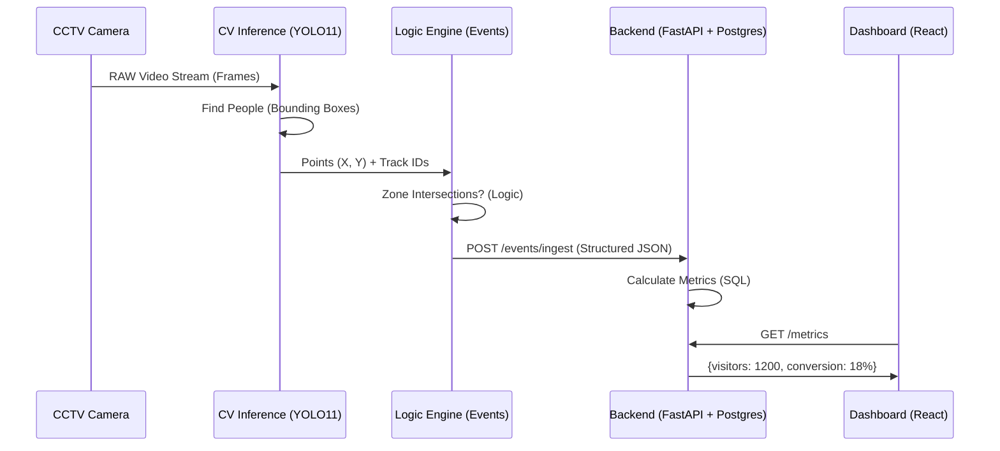

# Architecture Explained: The Purplle Intelligence Platform

Hello! As your mentor, I'll break down how this complex system works. Think of this as a journey of a "single pixel" from a camera until it becomes a "Conversion Rate" number on a dashboard.

## 1. End-to-End Flow (The Big Picture)

### 🌍 1.1 Life of a Frame
- **Capture**: The camera sends images (usually 24-30 per second).
- **Inference**: YOLO11 looks at the image and says "Hey! This rectangle is a person."
- **Tracking**: ByteTrack gives that rectangle an ID (e.g., `Person #42`).
- **Logic**: We check if `Person #42` just stepped over a virtual line we drew at the entrance.

---

## 2. The Four Key Lifecycles

### 👤 2.1 Visitor Tracking Lifecycle
1. **Creation**: A person is detected for the first time near the entrance. Track ID assigned.
2. **Persistence**: As they walk through the store, ByteTrack keeps localizing them frame-by-frame.
3. **Re-identification (ReID)**: If they walk behind a shelf and reappear, our **OSNet** model looks at their clothes/appearance and says "Wait, this new person looks exactly like Person #42 who disappeared 2 seconds ago. Merge them!"
4. **Termination**: They cross the EXIT line. Track ID is cleared from active memory.

### 📝 2.2 Event Lifecycle
1. **Trigger**: Code detects a "State Change" (e.g., Coordinate moved from "Store" to "Billing Queue").
2. **Generation**: An **Event Object** is created with a `UUID v4` (Unique ID) and a timestamp.
3. **Ingestion**: Sent to `POST /events/ingest`.
4. **Aggregation**: The Metrics Engine sums up all "ENTRY" events to calculate "Total Visitors".

### 🛍️ 2.3 Store Session Lifecycle
A "Session" starts when a person enters the store and ends when they leave.
- **Goal**: We want to know how long they stayed (Dwell Time) and where they went (Heatmap).

### 🌐 2.4 API Lifecycle
1. **Request**: Browser asks "Give me metrics for Store #1".
2. **Processing**: FastAPI queries PostgreSQL.
3. **Calculation**: The DB finds all entries and purchases for Store #1 today.
4. **Response**: A clean JSON is sent back to the React app.

---

## 3. Re-identification (ReID) Deep Dive
Normal tracking only works frame-by-frame. If the person leaves the camera view, they are "lost".
**OSNet** solves this by creating a **Visual Signature** (a set of numbers representing their look).
- Even if they leave and come back 5 minutes later, we compare their current signature with the "Active Signatures" in our database. If it's a 95% match, we know it's the same person!

## 4. Scalability: How do we handle 1,000 stores?
1. **Edge Processing**: We don't send raw video to the cloud (too expensive!). We process the YOLO11 logic *inside* the store on a small computer (NVIDIA Jetson) and only send "Event JSONs" to our FastAPI server.
2. **Database Sharding**: We split the `store_events` table by Store ID so no single database gets overwhelmed.
3. **Caching**: We use **Redis** to store current "Queue Counts" so we don't have to ask the heavy Postgres DB every second.
