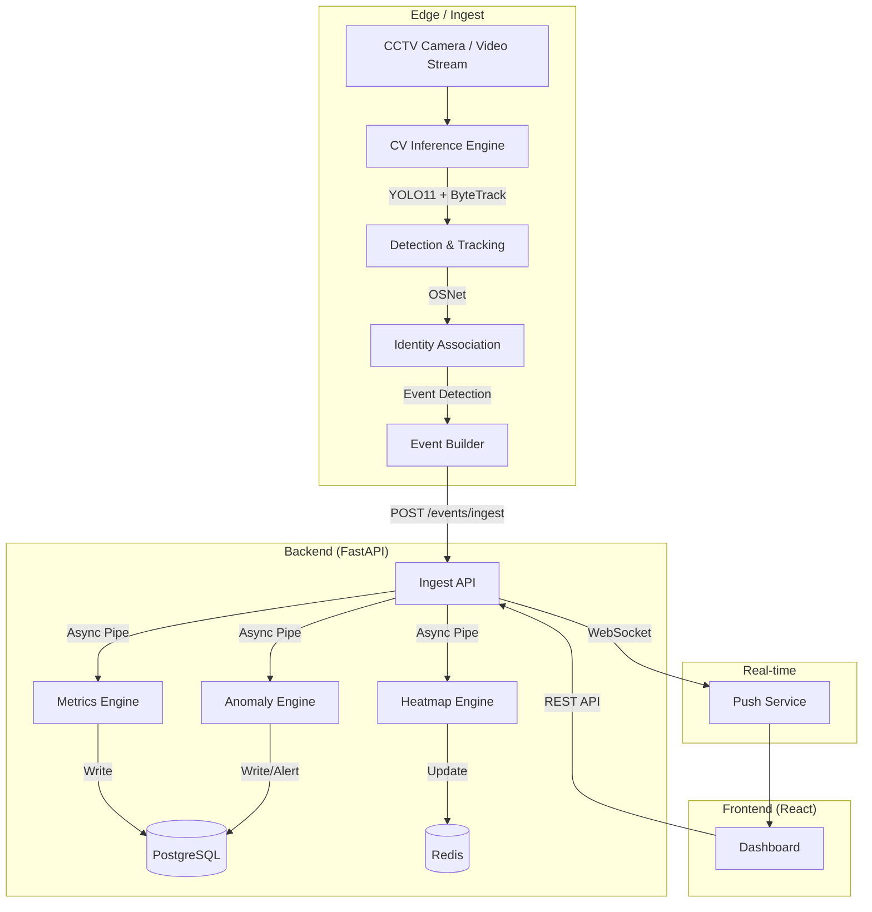

# System Design: Retail Store Intelligence Platform

## Overview
The Retail Store Intelligence Platform is a real-time computer vision system designed to extract actionable business metrics from raw CCTV footage. It identifies customer behavior patterns, queue dynamics, and area popularity to optimize store operations.

## Architecture Diagram (Mermaid)

## Data Flow
1. **Inference**: High-frame-rate detection using YOLO11.
2. **Tracking**: ByteTrack maintains person identity across frames using Kalman filters.
3. **Re-identification**: OSNet extracts visual embeddings to handle occlusions and re-entries.
4. **Event Generation**: Spatial logic (polygons/lines) triggers events like `ZONE_ENTER` or `BILLING_QUEUE_JOIN`.
5. **Analytics**:
   - **Metrics Engine**: Aggregates raw events into high-level KPIs.
   - **Anomaly Engine**: Statistical analysis of event streams to flag outliers.
   - **Heatmap Engine**: Accumulates spatial coordinates in Redis for real-time visualization.

## Event Schema
All events follow a unified UUID-v4 identified JSON schema with ISO timestamps and confidence scores.

## Security & Reliability
- **Idempotency**: Event IDs are used to prevent double-counting.
- **Resilience**: Redis caching for fast lookups and state management.
- **Traceability**: Structured logging with Trace IDs across components.
